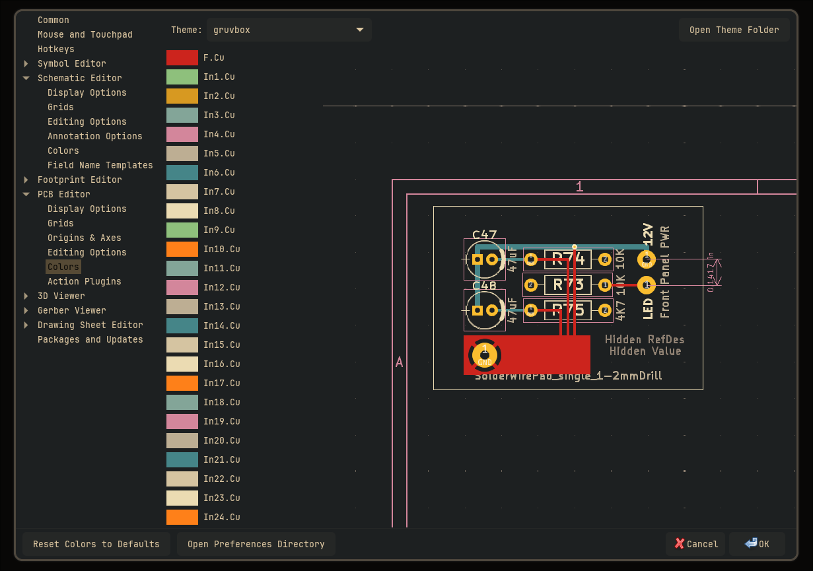

# KiCad Colour Scheme Converter

This program will convert any KiCad colour scheme into another one with colour matching a user defined palette.



# Installation and Usage

1. First, download the `colorscheme-wizard.py` file from this repository.

2. For the KiCad colour scheme to be converted, you can use the `user.json` scheme from this repository or any other KiCad
   colour scheme file.

   You can define your own JSON palette to use for the conversion, or you can create your own with the following format:

   ```json
   [
       "#aarrggbb",
       "#rrggbb",
       ...
   ]
   ```

   Hex colours can have a specified alpha, or no specified alpha which is assumed to be 1.0. Please see
   `gruvbox_palette.json` for an example.

3. Once you have an original colour scheme for conversion and a palette, you can perform the conversion by running the
   Python script:

   ```console
   python colorscheme-wizard.py ./user.json ./gruvbox_palette.json gruvbox.json gruvbox
   ```

   The last two arguments are the output file path and the name to given the colour scheme. For more more information,
   run `python colorscheme-wizard.py -h`.

   You will want to store your colour scheme somewhere where KiCad can access it. On Linux, that's in
   `.config/kicad/<version>/colors`. If you're not sure where to find this folder, follow the next step and instead of
   selecting the `Theme` drop down, click the `Open Theme Folder` button.

4. Load your colour scheme into KiCad by opening the software and clicking `Preferences > Preferences` in the toolbar.

   In the side menu, you will see several options listed such as `Symbol Editor`, `Schematic Editor`, `PCB Editor`, etc.
   You can change the colour scheme on an individual basis for any of these editors.

   To do so, click on the editor name, and then select `Colours` in the sub menu that appears. Across the top of the
   menu window, click the `Theme` drop down and select the colour scheme you just created.

   **NOTE:** Sometimes the colour schemes produced by the program are not perfect. KiCad may warn you that certain
   colour are hard to see or distinguish. In this case, you may have to tweak the colour scheme manually.

# Credits

The Gruvbox colour palette used in the example file `gruvbox_palette.json` is taken from [morhetz/gruvbox][gruvbox-repo].

The `user.json` file used in the example is the KiCad default colour scheme that ships with KiCad.

[gruvbox-repo]: https://github.com/morhetz/gruvbox
